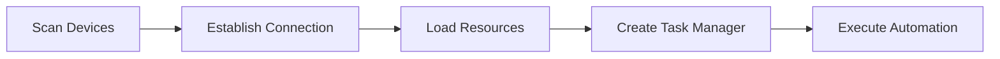

<!-- markdownlint-disable MD033 MD041 -->
<p align="center">
  
</p>

<div align="center">

# MaaMCP

[](LICENSE)
[](https://github.com/MaaXYZ/MaaFramework)
[](https://www.python.org/)

一个基于 [MaaFramework](https://github.com/MaaXYZ/MaaFramework) 的 Model Context Protocol (MCP) 服务器
为 AI 助手提供 Android 设备和 Windows 桌面自动化能力

[English](#english) | [中文](#中文)

</div>

---

## 中文

### 简介

MaaMCP 是一个 Model Context Protocol 服务器，将 MaaFramework 的强大自动化能力通过标准化的 MCP 接口暴露给 AI 助手（如 Claude）。通过本服务器，AI 助手可以：

- 🤖 **Android 自动化** - 通过 ADB 连接并控制 Android 设备/模拟器
- 🖥️ **Windows 自动化** - 控制 Windows 桌面应用程序
- 👁️ **智能识别** - 使用 OCR 识别屏幕文字内容
- 🎯 **精准操作** - 执行点击、滑动、文本输入、按键等操作
- 📸 **屏幕截图** - 获取实时屏幕截图进行视觉分析

### 功能特性

#### 🔍 设备发现与连接
- `find_adb_device_list` - 扫描可用的 ADB 设备
- `find_window_list` - 扫描可用的 Windows 窗口
- `connect_adb_device` - 连接到 Android 设备
- `connect_window` - 连接到 Windows 窗口

#### 📦 资源管理
- `load_resource` - 加载 OCR 模型和图像资源
- `create_tasker` - 创建自动化任务管理器

#### 👀 屏幕识别
- `ocr` - 光学字符识别（高效，推荐优先使用）
- `screencap` - 屏幕截图（按需使用，token 开销大）

#### 🎮 设备控制
- `click` - 点击指定坐标
- `swipe` - 滑动手势
- `input_text` - 输入文本
- `click_key` - 按键操作
- `scroll` - 鼠标滚轮（仅 Windows）

### 快速开始

#### 前置要求

- Python 3.8+
- Git
- [MaaFramework Release 包](https://github.com/MaaXYZ/MaaFramework/releases)（需放置于 `deps/` 目录）
- 对于 Android 自动化：ADB 和已连接的设备/模拟器
- 对于 Windows 自动化：无需额外配置

#### 安装步骤

1. **克隆仓库**
   ```bash
   git clone https://github.com/yourusername/MaaMCP.git
   cd MaaMCP
   ```

2. **下载 MaaFramework**

   从 [MaaFramework Releases](https://github.com/MaaXYZ/MaaFramework/releases) 下载最新版本，解压到 `deps/` 目录。

3. **下载 OCR 模型**（大文件，可能需要一些时间）
   ```bash
   git submodule update --init --recursive
   ```

   如果 git 下载失败，可前往 [Mirror酱](https://mirrorchyan.com/zh/projects?rid=MaaCommonAssets) 手动下载后解压到 `assets/MaaCommonAssets`。

4. **配置 OCR 模型**
   ```bash
   python configure.py
   ```

5. **安装 Python 依赖**

   **重要**：MCP 客户端需要能够访问这些依赖。有两种安装方式：

   **方式 A：全局安装（推荐，适用于所有 MCP 客户端）**
   ```bash
   pip install maafw fastmcp opencv-python
   ```

   **方式 B：虚拟环境安装（需要在配置中指定虚拟环境的 Python 路径）**
   ```bash
   # 创建虚拟环境
   python -m venv .venv

   # 激活虚拟环境
   # Windows:
   .venv\Scripts\activate
   # macOS/Linux:
   source .venv/bin/activate

   # 安装依赖
   pip install maafw fastmcp opencv-python
   ```

   如果使用方式 B，需要在后续 MCP 配置中使用虚拟环境的 Python 路径。

#### 配置 MCP 客户端

**注意**：如果使用虚拟环境安装依赖（方式 B），请将配置中的 `"command": "python"` 替换为虚拟环境的 Python 完整路径：
- Windows: `"F:/Project/Python/MaaMCP/.venv/Scripts/python.exe"`
- macOS/Linux: `"/path/to/MaaMCP/.venv/bin/python"`

##### Claude Desktop

编辑 Claude Desktop 配置文件：

**Windows**: `%APPDATA%\Claude\claude_desktop_config.json`
**macOS**: `~/Library/Application Support/Claude/claude_desktop_config.json`

**使用全局 Python（方式 A）：**
```json
{
  "mcpServers": {
    "maa": {
      "command": "python",
      "args": ["-m", "mcp_server"],
      "cwd": "C:/path/to/MaaMCP"
    }
  }
}
```

**使用虚拟环境（方式 B）：**
```json
{
  "mcpServers": {
    "maa": {
      "command": "C:/path/to/MaaMCP/.venv/Scripts/python.exe",
      "args": ["-m", "mcp_server"],
      "cwd": "C:/path/to/MaaMCP"
    }
  }
}
```

##### Cursor IDE

在项目根目录创建或编辑 `.cursor/mcp.json`：

**使用全局 Python（方式 A）：**
```json
{
  "mcpServers": {
    "MAA MCP": {
      "command": "python",
      "args": ["-m", "mcp_server"],
      "cwd": "${workspaceFolder}"
    }
  }
}
```

**使用虚拟环境（方式 B）：**
```json
{
  "mcpServers": {
    "MAA MCP": {
      "command": "${workspaceFolder}/.venv/Scripts/python.exe",
      "args": ["-m", "mcp_server"],
      "cwd": "${workspaceFolder}"
    }
  }
}
```

##### Claude Code CLI

在项目根目录创建或编辑 `.claude/settings.local.json`：

**使用全局 Python（方式 A）：**
```json
{
  "mcpServers": {
    "maa": {
      "command": "python",
      "args": ["-m", "mcp_server"],
      "cwd": "${workspaceFolder}"
    }
  }
}
```

**使用虚拟环境（方式 B）：**
```json
{
  "mcpServers": {
    "maa": {
      "command": "${workspaceFolder}/.venv/Scripts/python.exe",
      "args": ["-m", "mcp_server"],
      "cwd": "${workspaceFolder}"
    }
  }
}
```

##### OpenAI Codex CLI

使用 Codex CLI 命令添加 MCP 服务器：

```bash
# 添加 MCP 服务器（推荐方式）
cd C:/path/to/MaaMCP
codex mcp add maa -- python -m mcp_server

# 或直接运行 main.py（需要完整路径）
codex mcp add maa -- python C:/path/to/MaaMCP/mcp_server/main.py
```

配置将自动保存到 `~/.codex/config.toml`。配置在 CLI 和 IDE 扩展之间共享。

查看和管理 MCP 服务器：
```bash
# 列出所有 MCP 服务器
codex mcp list

# 移除 MCP 服务器
codex mcp remove maa
```

### 使用示例

配置完成后，在 Claude 中可以这样使用：

**Android 自动化示例：**
```
请帮我连接 Android 设备，然后识别屏幕上的文字内容
```

**Windows 自动化示例：**
```
请连接名为 "Visual Studio Code" 的窗口，识别其中的文本
```

MaaMCP 会自动：
1. 扫描可用设备/窗口
2. 建立连接
3. 加载必要的资源
4. 执行识别和操作任务

### 工作流程

MaaMCP 遵循严格的操作流程：


1. **扫描** - 使用 `find_adb_device_list` 或 `find_window_list`
2. **连接** - 使用 `connect_adb_device` 或 `connect_window`
3. **加载** - 使用 `load_resource` 加载 OCR 模型
4. **创建** - 使用 `create_tasker` 创建任务管理器
5. **操作** - 使用 OCR、点击、滑动等工具执行自动化

### 开发相关

#### 项目结构

```
MaaMCP/
├── mcp_server/
│   ├── main.py              # MCP 服务器主文件
│   ├── registry.py          # 对象注册表模块
│   └── screenshots/         # 临时截图目录（自动清理）
├── assets/
│   ├── resource/            # 资源文件
│   │   ├── model/ocr/      # OCR 模型
│   │   ├── image/          # 图像模板
│   │   └── pipeline/       # 任务流水线定义
│   └── MaaCommonAssets/    # 通用资源（git 子模块）
├── agent/                   # 自定义识别/动作扩展
├── configure.py             # OCR 模型配置脚本
├── install.py               # 打包安装脚本
└── check_resource.py        # 资源验证工具
```

#### 验证资源文件

```bash
python check_resource.py assets/resource
```

#### 构建发布包

```bash
python install.py v1.0.0
```

构建的发布包将位于 `install/` 目录。

### 安全说明

⚠️ **重要安全约束**：
- 所有 ADB 和窗口操作必须通过 MCP 工具执行
- 禁止直接执行 `adb` 命令或窗口句柄 API
- 这确保了 AI 助手操作的可控性和安全性

### 常见问题

#### OCR 识别失败，报错 "Failed to load det or rec"

确保已正确执行步骤 3 和 4：
1. 检查 `assets/MaaCommonAssets/OCR` 目录是否存在
2. 重新运行 `python configure.py`
3. 验证 `assets/resource/model/ocr` 目录包含模型文件

#### Python 命令无反应

Windows 10/11 自带的 "Python" 只是安装器。请从 [python.org](https://www.python.org/) 下载并安装完整版 Python。

#### 缺少 vc_redist 运行库

下载并安装 [Microsoft Visual C++ Redistributable](https://aka.ms/vs/17/release/vc_redist.x64.exe)。

#### MCP 服务器连接失败或报错 "ModuleNotFoundError"

这通常是因为 MCP 客户端使用的 Python 环境中没有安装必要的依赖。

**原因**：MCP 客户端（Claude Desktop、Cursor 等）不会自动激活虚拟环境，它们直接调用配置中指定的 Python 解释器。

**解决方案**：

1. **推荐方案**：在全局 Python 中安装依赖
   ```bash
   pip install maafw fastmcp opencv-python
   ```

2. **备选方案**：在 MCP 配置中使用虚拟环境的 Python 完整路径
   - Windows: 将 `"command": "python"` 改为 `"command": "C:/path/to/.venv/Scripts/python.exe"`
   - macOS/Linux: 改为 `"command": "/path/to/.venv/bin/python"`

3. **验证依赖**：
   ```bash
   # 使用配置中的 Python 路径测试
   python -c "import maafw, fastmcp; print('Dependencies OK')"
   ```

### 许可证

本项目采用 [GNU AGPL v3](LICENSE) 许可证。

### 致谢

- **[MaaFramework](https://github.com/MaaXYZ/MaaFramework)** - 提供强大的自动化框架
- **[FastMCP](https://github.com/jlowin/fastmcp)** - 简化 MCP 服务器开发
- **[Model Context Protocol](https://modelcontextprotocol.io/)** - 定义 AI 工具集成标准

---

## English

### Introduction

MaaMCP is a Model Context Protocol server that exposes MaaFramework's powerful automation capabilities through standardized MCP interfaces to AI assistants (like Claude). With this server, AI assistants can:

- 🤖 **Android Automation** - Connect and control Android devices/emulators via ADB
- 🖥️ **Windows Automation** - Control Windows desktop applications
- 👁️ **Smart Recognition** - Use OCR to recognize on-screen text
- 🎯 **Precise Operations** - Execute clicks, swipes, text input, key presses, and more
- 📸 **Screenshots** - Capture real-time screenshots for visual analysis

### Features

#### 🔍 Device Discovery & Connection
- `find_adb_device_list` - Scan available ADB devices
- `find_window_list` - Scan available Windows windows
- `connect_adb_device` - Connect to Android device
- `connect_window` - Connect to Windows window

#### 📦 Resource Management
- `load_resource` - Load OCR models and image resources
- `create_tasker` - Create automation task manager

#### 👀 Screen Recognition
- `ocr` - Optical Character Recognition (efficient, recommended)
- `screencap` - Screenshot capture (use sparingly, high token cost)

#### 🎮 Device Control
- `click` - Click at coordinates
- `swipe` - Swipe gesture
- `input_text` - Input text
- `click_key` - Key press
- `scroll` - Mouse wheel (Windows only)

### Quick Start

#### Prerequisites

- Python 3.8+
- Git
- [MaaFramework Release](https://github.com/MaaXYZ/MaaFramework/releases) (place in `deps/` directory)
- For Android automation: ADB and connected device/emulator
- For Windows automation: No additional setup required

#### Installation

1. **Clone the repository**
   ```bash
   git clone https://github.com/yourusername/MaaMCP.git
   cd MaaMCP
   ```

2. **Download MaaFramework**

   Download the latest release from [MaaFramework Releases](https://github.com/MaaXYZ/MaaFramework/releases) and extract to `deps/` directory.

3. **Download OCR models** (large files, may take time)
   ```bash
   git submodule update --init --recursive
   ```

4. **Configure OCR models**
   ```bash
   python configure.py
   ```

5. **Install Python dependencies**

   **Important**: MCP clients need to access these dependencies. Two installation methods:

   **Method A: Global installation (Recommended, works for all MCP clients)**
   ```bash
   pip install maafw fastmcp opencv-python
   ```

   **Method B: Virtual environment installation (Requires specifying venv Python path in config)**
   ```bash
   # Create virtual environment
   python -m venv .venv

   # Activate virtual environment
   # Windows:
   .venv\Scripts\activate
   # macOS/Linux:
   source .venv/bin/activate

   # Install dependencies
   pip install maafw fastmcp opencv-python
   ```

   If using Method B, you must specify the virtual environment's Python path in MCP configuration.

#### Configure MCP Clients

**Note**: If using virtual environment (Method B), replace `"command": "python"` with the full Python path:
- Windows: `"C:/path/to/MaaMCP/.venv/Scripts/python.exe"`
- macOS/Linux: `"/path/to/MaaMCP/.venv/bin/python"`

##### Claude Desktop

Edit Claude Desktop configuration:

**Windows**: `%APPDATA%\Claude\claude_desktop_config.json`
**macOS**: `~/Library/Application Support/Claude/claude_desktop_config.json`

**Using global Python (Method A):**
```json
{
  "mcpServers": {
    "maa": {
      "command": "python",
      "args": ["-m", "mcp_server"],
      "cwd": "C:/path/to/MaaMCP"
    }
  }
}
```

**Using virtual environment (Method B):**
```json
{
  "mcpServers": {
    "maa": {
      "command": "C:/path/to/MaaMCP/.venv/Scripts/python.exe",
      "args": ["-m", "mcp_server"],
      "cwd": "C:/path/to/MaaMCP"
    }
  }
}
```

##### Cursor IDE

Create or edit `.cursor/mcp.json` in project root:

**Using global Python (Method A):**
```json
{
  "mcpServers": {
    "MAA MCP": {
      "command": "python",
      "args": ["-m", "mcp_server"],
      "cwd": "${workspaceFolder}"
    }
  }
}
```

**Using virtual environment (Method B):**
```json
{
  "mcpServers": {
    "MAA MCP": {
      "command": "${workspaceFolder}/.venv/Scripts/python.exe",
      "args": ["-m", "mcp_server"],
      "cwd": "${workspaceFolder}"
    }
  }
}
```

##### Claude Code CLI

Create or edit `.claude/settings.local.json` in project root:

**Using global Python (Method A):**
```json
{
  "mcpServers": {
    "maa": {
      "command": "python",
      "args": ["-m", "mcp_server"],
      "cwd": "${workspaceFolder}"
    }
  }
}
```

**Using virtual environment (Method B):**
```json
{
  "mcpServers": {
    "maa": {
      "command": "${workspaceFolder}/.venv/Scripts/python.exe",
      "args": ["-m", "mcp_server"],
      "cwd": "${workspaceFolder}"
    }
  }
}
```

##### OpenAI Codex CLI

Add the MCP server using Codex CLI commands:

```bash
# Add MCP server (recommended)
cd C:/path/to/MaaMCP
codex mcp add maa -- python -m mcp_server

# Or run main.py directly (requires full path)
codex mcp add maa -- python C:/path/to/MaaMCP/mcp_server/main.py
```

The configuration will be automatically saved to `~/.codex/config.toml`. Configuration is shared between CLI and IDE extension.

View and manage MCP servers:
```bash
# List all MCP servers
codex mcp list

# Remove MCP server
codex mcp remove maa
```

### Usage Examples

After configuration, you can use it in Claude:

**Android Automation Example:**
```
Please connect to my Android device and recognize the text on screen
```

**Windows Automation Example:**
```
Please connect to the "Visual Studio Code" window and recognize its text
```

MaaMCP will automatically:
1. Scan available devices/windows
2. Establish connection
3. Load necessary resources
4. Execute recognition and operation tasks

### Workflow

MaaMCP follows a strict operational workflow:



1. **Scan** - Use `find_adb_device_list` or `find_window_list`
2. **Connect** - Use `connect_adb_device` or `connect_window`
3. **Load** - Use `load_resource` to load OCR models
4. **Create** - Use `create_tasker` to create task manager
5. **Operate** - Use OCR, click, swipe, etc. for automation

### Development

#### Project Structure

```
MaaMCP/
├── mcp_server/
│   ├── main.py              # MCP server main file
│   ├── registry.py          # Object registry module
│   └── screenshots/         # Temporary screenshots (auto-cleanup)
├── assets/
│   ├── resource/            # Resource files
│   │   ├── model/ocr/      # OCR models
│   │   ├── image/          # Image templates
│   │   └── pipeline/       # Task pipeline definitions
│   └── MaaCommonAssets/    # Common assets (git submodule)
├── agent/                   # Custom recognition/action extensions
├── configure.py             # OCR model configuration script
├── install.py               # Package building script
└── check_resource.py        # Resource validation tool
```

#### Validate Resource Files

```bash
python check_resource.py assets/resource
```

#### Build Release Package

```bash
python install.py v1.0.0
```

The built package will be in the `install/` directory.

### Security Notes

⚠️ **Important Security Constraints**:
- All ADB and window operations must go through MCP tools
- Direct execution of `adb` commands or window handle APIs is prohibited
- This ensures AI assistant operations are controlled and secure

### FAQ

#### OCR recognition fails with "Failed to load det or rec"

Ensure steps 3 and 4 were completed correctly:
1. Check if `assets/MaaCommonAssets/OCR` directory exists
2. Re-run `python configure.py`
3. Verify `assets/resource/model/ocr` directory contains model files

#### Python command not responding

Windows 10/11 includes a "Python" that's just an installer. Download and install full Python from [python.org](https://www.python.org/).

#### Missing vc_redist runtime library

Download and install [Microsoft Visual C++ Redistributable](https://aka.ms/vs/17/release/vc_redist.x64.exe).

#### MCP server connection failed or "ModuleNotFoundError"

This usually happens because the Python environment used by MCP clients doesn't have the required dependencies installed.

**Cause**: MCP clients (Claude Desktop, Cursor, etc.) do not automatically activate virtual environments. They directly call the Python interpreter specified in the configuration.

**Solutions**:

1. **Recommended**: Install dependencies in global Python
   ```bash
   pip install maafw fastmcp opencv-python
   ```

2. **Alternative**: Use virtual environment's full Python path in MCP configuration
   - Windows: Change `"command": "python"` to `"command": "C:/path/to/.venv/Scripts/python.exe"`
   - macOS/Linux: Change to `"command": "/path/to/.venv/bin/python"`

3. **Verify dependencies**:
   ```bash
   # Test using the Python path from your config
   python -c "import maafw, fastmcp; print('Dependencies OK')"
   ```

### License

This project is licensed under [GNU AGPL v3](LICENSE).

### Acknowledgments

- **[MaaFramework](https://github.com/MaaXYZ/MaaFramework)** - Provides powerful automation framework
- **[FastMCP](https://github.com/jlowin/fastmcp)** - Simplifies MCP server development
- **[Model Context Protocol](https://modelcontextprotocol.io/)** - Defines AI tool integration standards
